Environnement de travail
========================

Mettre en place et savoir utiliser correctement son environnement
de travail Python est **essentiel**. Celui-ci comprend:

* **Internet**: bien connaître les sites majeurs (StackOverflow, GitHub, etc.)
  permettant de récupérer des informations, du code, de résoudre les bugs
  rencontrés et trouver des ressources pour apprendre Python.
* Invite de commande (**Command Prompt**): même si l'usage de cet utilitaire
  Windows n'est ni intuitif ni esthétique, son maniement basique
  se révèle être bien utile pour le contrôle de Python et de ses utilitaires.
  (On pourra aussi utiliser **PowerShell** ou **Terminal**).
* Gestionnaire d'environnement (*Environment Manager*): **conda** permet de
  gérer les différentes versions de Python et des dépendances dont nous
  avons besoin pour un exécuter un script Python.
* Gestionnaire de package (*Package Manager*): **conda** permet aussi de gérer
  l'installation de packages; **pip** est un utilitaire effectuant la même
  chose et très présent dans le monde Python.
* Environnement de développement (*IDE* pour *Integrated Development Environment*): **Spyder** est un IDE plutôt taillé
  pour des applications scientifiques, certaines de ses fonctionnalités
  le rendent particulièrement appropriés pour l'apprentissage de Python et
  l'écriture rapide de scripts.
* Terminal Python: du code **Python** peut être exécuté directement
  dans un terminal en *mode interactif*, ligne par ligne, cela permet de tester
  rapidement des petits morceaux de code (copier/coller depuis un
  site internet par exemple) pour répondre aux questions qu'on peut
  se poser lorsqu'on apprend le langage ou lorsqu'on écrit un script.

Internet
--------

Stack Overflow
**************

Des recherches Google vont très souvent aboutir à des pages d'un site de
questions/réponses appelés **Stack Overflow (SO)**. Python étant un langage
populaire, la plupart des questions que vous allez vous poser ont déjà été
posées sur ce site (si ce n'est pas le cas, vous vous posez peut-être une
mauvaise question).

La communauté  **SO** est importante, ses membres incluent des programmeurs 
expérimentés qui passent du temps à rédiger des réponses claires et complètes.
Surtout lorsque l'on débute (mais pas seulement), il est très fréquent d'avoir
recours à ce site pour trouver rapidement une information précise. Il est même
possible de copier directement le code que l'on voit sur le site dans un
script ou interpréteur Python pour le tester directement. Ainsi, il est
possible d'élaborer un script en faisant des copier/coller de codes postés sur
**SO**. Même si cette pratique ("stackoverflow programming") n'est pas des
plus recommandées, il est en effet important de comprendre un minimum le code
que l'on utilise, elle est très efficace.


Voici un exemple de question/réponse trouvé sur **SO** après avoir cherché
dans Google ``python slice notation``. Le nombre ``2886`` à gauche est un
indicateur de la qualité de la question. En bas à droite, on peut voir que
la question a été posée en 2009 par l'OP (Original Poster) ``Simon``.

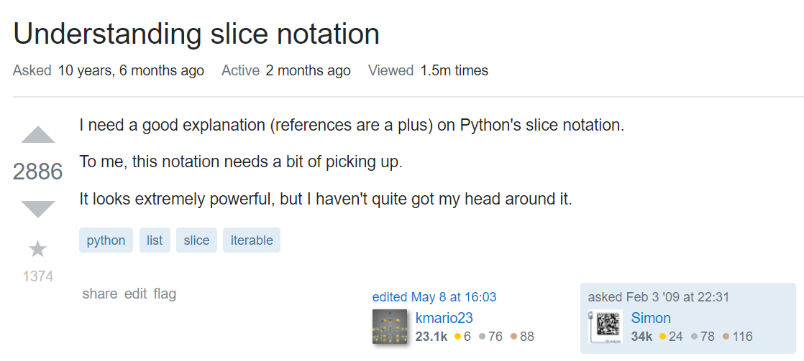

Les réponses affichées sous la question sont classées par défaut par nombre
de votes. Ainsi, la première réponse que l'on voit est celle que la communauté
a le plus apprécié. Ici, ``3894`` personnes de la communauté ont jugé la 
réponse utile. Le symbole coché indique que la réponse a été acceptée par l'OP.

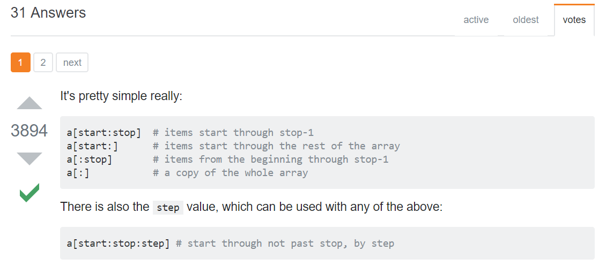

GitHub
******

Avant d'introduire **GitHub**, il est nécessaire de comprendre ce qu'est
**Git**. Il s'agit d'un logiciel open-source qui permet de faire de la
gestion de versions de projet informatique. La gestion de versions que vous
pratiquez certainement consiste à changer le nom d'un fichier (document Word
par exemple) de v1 à v2, v2 à v3, etc. **Git** fournit une méthode plus
élaborée et pratique qui permet de suivre/archiver/contrôler précisément
l'évolution d'un projet dont le nombre de contributeurs peut être très grand
(des milliers de personnes). Une des particularités de **Git** est qu'il
s'agit d'un système distribué: un contributeur peut travailler et enregistrer
les changements qu'il a apportés au projet chez lui, puis les enregistrer
au niveau distribué du système. Ce niveau distribué peut être un serveur
internet.

Même s'il existe d'autre logiciel de gestion de versions (Subversion,
Mercurial), **Git** est de loin le plus utilisé.

**GitHub** est un site internet qui utilise **Git** pour assurer la gestion
de versions des projets informatiques qu'il héberge. En plus de cela, il
propose des options et des aides au développement de ces projets. A l'instar
de **Git**, **GitHub** est le site d'hébergement de projets informatique le
plus utilisé (GitLab, BitBucket, SourceForge). Il permet à tout un chacun
d'héberger gratuitement un projet informatique en ligne.

Énormément de projets open-source sont hébergés sur **GitHub**, dont
`Python <https://github.com/python/cpython>`_ lui-même, `conda <https://github.com/conda/conda>`_,
`pip <https://github.com/pypa/pip>`_, `Spyder <https://github.com/spyder-ide/spyder>`_,
`pandas <https://github.com/pandas-dev/pandas>`__, `QGIS <https://github.com/qgis/QGIS>`_, etc.

L'intérêt de ce site dans l'écriture d'un script est double:

* Découvrir facilement de nombreux projets afin de voir si ce que l'on
  recherche à faire avec notre script n'a pas déjà été écrit et publié.
  Si oui, on pourrait réutiliser le code en question (vérifier la licence).
* Avoir accès à du code Python de bonne qualité afin d'apprendre et de s'en
  inspirer.

L'exemple ci-dessous montre le code inclus dans le module ``timeit.py`` de
Python. On veut voir en haut à droit le nombre ``26,162`` de Stars que le
projet a. Ce nombre, élevé, correspond au nombre de personnes qui suivent/
sont intéressés par le projet. Il est un bon indicateur de sa qualité. A
l'inverse, un projet avec quelques Stars seulement pourra contenir du code
de moins bonne qualité.

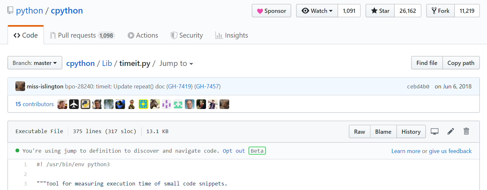

NB: Le module ``timeit.py`` a eu 15 contributeurs différents depuis sa
création. Le premier contributeur, dont l'image est la première sur la
gauche, est Guido van Rossum, le créateur de Python. 

Documentations officielles
**************************

Python
######

La documentation officielle de Python est une ressource importante et
relativement facile à aborder. Elle est disponible pour les différentes
versions de Python et en plusieurs langues, incluant le Français. Il est
toutefois recommandé de privilégier la version Anglaise, pour se familiariser
avec les termes techniques et faciliter les recherches Google.

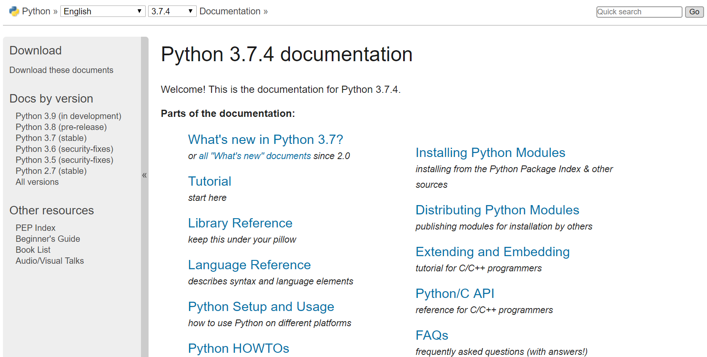

Packages
########

Les packages (librairies) du monde Python sont très souvent bien documentés.
Ceci est particulièrement vrai pour les packages scientifiques. Il suffit
alors de visiter leur site pour trouver des informations précises sur la
manière de les installer/utiliser. On trouvera notamment des guides
de démarrage rapide, des directives détaillées sur les fonctions
que ces packages contiennent et des exemples d'applications.

* `NumPy <https://www.numpy.org/>`_
* `pandas <https://pandas.pydata.org/pandas-docs/stable/>`__
* `GeoPandas <http://geopandas.org/>`_
* `Rasterio <https://rasterio.readthedocs.io/en/stable/>`_
* `Matplotlib <https://matplotlib.org/>`_
* `Bokeh <https://bokeh.pydata.org/en/latest/>`_
* ...


Cheat Sheets
************

Les **Cheat Sheets** sont des fiches qui synthétisent les informations les
plus importantes afin d'utiliser un logiciel, un package, etc. Voici une
liste (non exhaustive) de **Cheat Sheets**:

* TODO: En ajouter d'autres.
* `pandas <http://pandas.pydata.org/Pandas_Cheat_Sheet.pdf>`_
* `conda <https://docs.conda.io/projects/conda/en/latest/user-guide/cheatsheet.html>`_


Tutoriels
*********

Les tutoriels (*tutorial*) sont omniprésents sur internet. Lorsqu'on commence
à utiliser un nouveau logiciel/package, il est recommandé de réaliser
**d'abord** un tutoriel dédié. Cela permet de comprendre le fonctionnement
général de l'outil et d'en maîtriser les bases. Même s'il est des fois
difficile d'accorder du temps à cette étape, elle est bénéfique sur le long.

Une difficulté, toutefois, est de s'y retrouver dans la multitude des
tutoriels à disposition. La popularité de Python est telle que le nombre
de blogs/sites y consacrant des sujets est unique. Ceci est à la fois
une force du langage et de son écosystème, mais peut être problématique
lorsqu'on a besoin d'une réponse rapide.

Pour trouver un bon tutoriel, il est recommandé de chercher des tutoriels:

* en **Anglais**: même si  un tutoriel en Français
  peut constituer une entrée douce en matière, il y a plus de chance de
  trouver des tutoriels en Anglais plus complets et plus à jour. Comme le
  langage Python est lui-même en Anglais, que le vocabulaire des packages
  est aussi en Anglais, l'apprentissage par des tutoriels en Anglais
  facilite leur utilisation sur le long terme.
* le plus récent possible: tout change très vite dans le monde informatique,
  une fonction d'un package peut être supprimée (*deprecated*) entre deux
  versions, rendant obsolète une partie de la documentation non-officielle
  disponible sur internet. Il faut faire particulièrement attention
  à **ne pas suivre de tutoriel en Python 2**.
* faciles à lire: souvent, les tutoriels esthétiques sont ceux dont le 
  contenu est de qualité.

Voici deux sites particulièrement intéressants:

* `Official Python Tutorial <https://docs.python.org/3/tutorial/>`_: le tutoriel
  de la documentation officielle de Python, il s'agit d'une source sûre.
* `Real Python <https://realpython.com/>`_: des tutoriels agréables à lire, complets,
  pour tous niveaux.

Notebooks
*********

Les notebooks dans l'écosystème Python sont le plus connus sous la forme
des **Jupyter Notebooks**. Ce sont des fichiers qui contiennent à
la fois du texte, qu'on peut mettre en forme facilement, et du code, qu'on
peut exécuter facilement et dont le résultat (tableau, image, etc.) est
affiché directement sous le code. Ces fichiers sont visualisables et
éditables directement dans un navigateur (Chrome, Firefox, etc.). Ils
constituent donc un très bon moyen pour:

* présenter une librairie sous la forme d'un tutoriel
* analyser des données

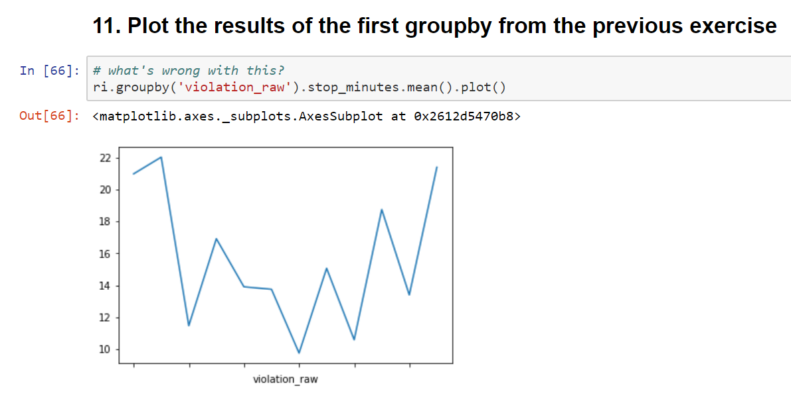

Les Jupyter Notebooks ont les caractéristiques suivantes:

* Ils ont l'extension **.ipynb** qui provient du nom *IPython Notebook*,
  le nom initial de ces notebooks
* Pour les ouvrir, il faut utiliser l'application du même nom
  **Jupyter Notebook**, ou sa nouvelle version **JupyterLab**. L'ouverture
  basique d'un notebook à partir d'une de ces applications entraîne
  le démarrage d'un serveur
  local. Ce serveur déploie le notebook de telle manière qu'il est
  maintenant possible de le lire et l'éditer depuis un navigateur
  (Chrome, Firefox, etc.). En même temps, l'application démarre un kernel,
  qui est un programme permettant d'exécuter le code inclut dans le notebook.
  Le kernel par défaut est **IPython**, il permet d'exécuter du code Python.
* Ils sont divisés en cellules. Ces cellules peuvent contenir du texte
  écrit dans le langage de balise **Markdown**. Ce langage permet de
  mettre facilement en forme le document (titre, police en gras, etc.). Les
  cellules peuvent aussi contenir du code Python. Lorsque le code est exécuté,
  le résultat (output) est affiché juste en dessous de la cellule.

Les notebooks sont souvent partagés directement sur GitHub, plusieurs
approches sont possibles afin de les utiliser:

* On peut **directement télécharger** les notebooks sur GitHub. Il vaut mieux
  télécharger le répertoire (repo) complet, si les notebooks s'appuient
  sur des données d'entrée enregistrées dans d'autres dossiers. Il sera
  peut-être nécessaire de créer un nouvel environnement *conda* et d'installer
  les packages nécessaires au fonctionnement des notebooks.
* Le logiciel **git** permet de télécharger facilement un répertoire
  sur GitHub. Il faut d'abord l'`installer <https://git-scm.com/download/win>`_.
  La commande ``git clone https://github.com/username/repo`` va télécharger
  le contenu du répertoire dans le dossier où elle a été exécutée. A nouveau,
  il sera peut-être nécessaire
  d'installer un environnement *conda* spécifique.
* `binder <https://mybinder.org/>`_ est un site qui héberge des notebooks
  et permet de les exécuter directement sur internet, il n'est donc pas
  nécessaire d'installer quoi que ce soit. Si une petite image (badge)
  binder est visible sur un répertoire GitHub, cela veut dire que les
  notebooks qu'il contient sont hébergés sur binder.

Pour ouvrir un notebook, il faut exécuter la commande ``jupyter notebook``
(ou ``jupyter lab``) dans le dossier où se trouve le ou les fichiers *.ipynb*.

Autres ressources
*****************

* **Youtube**: Il y a énormément de vidéos concernant Python sur Youtube.
  Certaines sont sous la forme de tutoriels, on voit ce que la personne
  code en direct pendant qu'on entend les explications. D'autres sont
  des enregistrements de conférence (PyCon, PyData, etc.).
* Certains sites (DataCamp) permettent d'exécuter du code directement
  sur internet, sans avoir besoin d'installer quoi que ce soit sur son PC.
* Livres: il y a beaucoup de livres sur Python et son monde. Un qui pourra
  nous intéresser est `Automating the Boring Stuff with Python <https://automatetheboringstuff.com/>`_,
  qui est visible gratuitement.
* `Practical Business Python <https://pbpython.com/>`_: un blog avec des articles
  sur la manière d'intégrer Python dans les entreprises.
* `Cours en français de l'Université Paris Diderot <https://python.sdv.univ-paris-diderot.fr/>`_:


Command Prompt
--------------

La **Command Prompt** est un programme qui permet d'interagir en ligne
de commande avec Windows. Pour l'ouvrir, il faut appuyer sur la touche
``Windows``, taper ``cmd``, et appuyer sur la touche ``Entrée``.
Une fenêtre noire s'affiche sur l'infini.

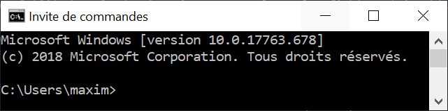

Le texte à gauche du symbole ``>`` indique dans quelle dossier la Command
Prompt est active. Le programme dispose de commandes internes, il suffit
de taper ``help`` pour en voir une liste. Pour accéder l'aide d'une
commande quelconque, il faut rajouter l'option ``/?`` après son nom (ex:
``cd /?``).

Seules quelques commandes nous seront utiles. La première est ``cd`` (pour
Change Directory), elle
permet de changer le répertoire en cours. Voici comment l'utiliser:

* ``cd C:\ProgramData`` pour aller dans le répertoire **ProgramData**
* ``cd ..`` pour aller dans le répertoire **Users**, ``..`` signifie
  le répertoire parent, ``.`` signifie le répertoire en cours.
* ``cd ..\..`` pour aller à la racine du disque **C:**
* ``cd "C:\Program Files"`` pour aller dans le répertoire **Program Files**,
  les guillemets sont nécessaires pour les liens qui incluent des espaces
* ``E:`` pour aller dans le disque **D:** (``cd E:`` ne fonctionne pas,
  mais ``cd /D E:`` fonctionne)

.. note::

    Après avoir tapé ``cd`` ou ``cd Document\``, appuyer sur
    la touche ``Tab`` plusieurs fois pour faire défiler les dossiers
    disponibles (dans le deuxième cas, les dossiers disponibles dans
    **Documents** sont affichés). L'utilisation de la touche ``Tab``
    (**autocompletion**) est possible après n'importe quelle commande, elle
    permet aussi de faire défiler les fichiers lorsque pertinent.

La deuxième est ``dir`` (pour *DIRectory*), elle permet d'afficher la
liste des dossiers des fichiers et dossiers présents dans le dossier
en cours. La commande ``dir /b *.py > pythonfiles.txt`` liste tous les
fichiers situés dans le dossier en cours et
dont l'extension est *.py* (``*`` est le symbole *wildcard*,
il remplace ici le nom du fichier), et les enregistre dans le
fichier texte *pythonfiles.txt*.

La troisième est ``cls`` (pour *CLear Screen*), elle permet de réinitialiser
l'écran.

Lorsqu'un programme est en train d'être exécuté depuis la **Command Prompt**,
on peut l'arrêter en appuyant sur ``Ctrl + C``.

.. tip::

    Après avoir exécuté plusieurs commandes, on peut utiliser les flèches
    du haut et du bas pour parcourir l'historique des commandes exécutées.
    On peut aussi appuyer sur la touche ``F7`` pour afficher une fenêtre
    de l'historique et exécuter à nouveau une commande en la sélectionnant.
    Les autres touches ``FX`` permettent d'effectuer des actions similaires.
    Voir `ici <https://www.howtogeek.com/254401/34-useful-keyboard-shortcuts-for-the-windows-command-prompt/>`_
    pour une liste des raccourcis disponibles.

La **Command Prompt** permet aussi d'exécuter des programmes présents dans
le **PATH**. Le **PATH** est une variable d'environnement sous la forme
d'une liste de dossiers. Lorsque l'on exécute quelque chose qui n'est pas 
une commande de la **Command Prompt**, le programme va chercher dans
les dossiers du **PATH** s'il existe un fichier exécutable (*.exe*, *.bat*
...) du même nom.

.. tip::

    Pour afficher les dossiers dans le **PATH**, il suffit d'exécuter
    ``echo %PATH%``.

Comme ``notepad`` n'est pas une commande de la **Command Prompt**, le programme
cherche dans le **PATH**, trouve le fichier **notepad.exe** dans un
des dossiers d'installation de Windows, et l'exécute, ce qui a pour effet
d'ouvrir le bloc-notes.

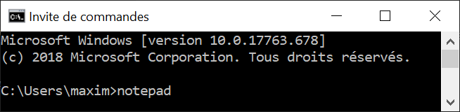

Afin de savoir où se trouve l'exécutable **notepad.exe**, il suffit
d'exécuter ``where notepad`` ce qui affiche le lien absolu vers le ou
les fichiers **notepad.exe** trouvés dans le **PATH**. **where** étant
lui-même un exécutable, ``where where`` indique sa localisation.

Pour lancer la **Command Prompt** directement dans un dossier ouvert avec
l'explorateur de fichiers, on peut:

* taper ``cmd`` dans la barre d'adresse et appuyer sur la touche
  ``Entrée``. Cette méthode est intéressante car elle fonctionne
  avec tous les exécutables du **PATH** de Windows. ``calc`` ouvrera
  la calculatrice. ``python`` (une fois installé) lancera l'interpréteur
  Python dans le dossier courant
* appuyer sur la touche ``ctrl``, faire un clic droit dans la fenêtre
  pour ouvrir un menu contextuel et cliquer sur *Ouvrir avec l'invite
  de commande ici**

.. tip::

    Même si la **Command Prompt** est suffisante pour ce qu'on a
    à faire, on peut utiliser à la place le terminal **PowerShell**
    , qui est plus récent, plus complet et un peu plus coloré.

conda et pip
------------

Leurs objectifs
***************

**Python** est un langage qui est doté d'un riche écosystème de packages.
Quand on code en **Python**, on est alors invité à réutiliser ces packages
afin de ne pas réinventer la roue. Mais cela n'est pas si simple que cela
pour les raisons suivantes:

* il faut pouvoir installer facilement ces packages
* il existe plusieurs versions de **Python**, certains packages ne
  fonctionnent donc pas sur la ou les dernières versions disponibles
* les packages ont eux aussi plusieurs versions, et comme ils dépendent
  les uns des autres (**Pandas**, par exemple, dépend de **Numpy** et
  de **Matplotlib**), il est nécessaire de s'assurer qu'on installe
  la bonne combinaison de versions
* certains packages, notamment les packages scientifiques, ne sont pas
  écrits qu'en Python (pure Python), mais aussi en d'autres langages de
  plus bas niveaux (**C**, **Fortran**, etc.) afin d'accélérer les calculs:
  cela complexifie la distribution et l'installation de ces packages-là

**conda** est un logiciel qui permet d'adresser l'ensemble de ces
difficultés:

* il permet d'installer des packages Python en les téléchargeant sur
  internet
* il peut créer des environnements virtuels. On peut ainsi créer
  un environnement dans lequel Python 3.7 est installé, et un autre dans
  lequel c'est Python 3.6 qui est installé. Ces deux environnements sont
  totalement isolés l'un de l'autre. **conda** comprend par défaut un
  environnement virtuel appelé **base**.
* il vérifie que les versions des packages installées sont bien cohérentes
  les unes avec les autres. Comme on peut avoir un grand nombre de
  packages, cette vérification prend des fois du temps.
* les packages téléchargeables par **conda** sont en fait déjà
  pré-installés (*build*), leur installation est donc directe même si les
  packages sont complexes (comme *Numpy*).

D'autres outils permettent de gérer
des environnements virtuels (*virtualenv*),
l'avantage de **conda** est que plusieurs fonctionnalités sont encapsulées
dans un seul et même programme, c'est pourquoi nous l'utiliserons
principalement.

.. note::

    **conda** ne permet pas seulement d'installer des packages
    **Python**. On peut installer le langage **R** et ses propres packages.
    On peut aussi installer d'autres logiciels, comme **QGIS**.

.. note::

    Le téléchargement d'un package avec **conda** regarde par défaut
    dans la *channel default* si le package recherché se trouve dans
    un des *repositories* vers laquelle cette *channel* pointe. La *channel*
    **conda-forge** est une alternative intéressante, elle est maintenue
    par une communauté d'utilisateurs et est celle qui comprend le plus
    grand nombre de packages. On peut configurer **conda** pour qu'il
    télécharge les packages uniquement depuis la *channel conda-forge*.

**pip** est l'installeur officiel de packages de Python. Il prédate
**conda** et permet de télécharger des packages sur le site
`PyPi <https://pypi.org/>`_. Il s'agit du site officiel de dépôt de
package Python. Tous les packages présents sur ce site sont
téléchargeables avec **pip**. Il y en a aujourd'hui (08/2019) plus de
193 000. Lorsqu'un nouveau package est installé avec **pip**, **pip**
ne vérifie pas aussi précisément que toutes les relations de dépendance
entre l'ensemble des packages installés sont bien satisfaites.

Installation
************

**conda** est un logiciel gratuit et open-source distribué par la
société **Anaconda**. **Anaconda** est un nom qui a plusieurs usages.
Il désigne donc cette entreprise, qui s'appelait à l'origine
**Continuum Analytics**. Elle a développé **Anaconda** et **Miniconda**,
qui sont des distributions qui incluent plusieurs logiciels et librairies.
**Anaconda** est la distribution complète, elle intègre directement
**conda** et une interface graphique **Anaconda Navigator**.
L'environnement *base*, qui inclut *Python*, comprend déjà de nombreux
packages utiles pour la data science. Installer la distribution **Anaconda**
permet donc d'obtenir rapidement un outil de travail permettant d'écrire
des scripts en Python. Cette distribution est toutefois lourde. **Miniconda**
est le pendant minimal d'**Anaconda**, cette distribution-là comprend
**conda**, **Python** et c'est à peu près tout. On installe ensuite
manuellement les packages que l'on souhaite utiliser.
L'entreprise **Anaconda** se charge aussi d'héberger le `site internet <https://anaconda.org/anaconda>`_
à partir duquel les packages sont téléchargés par **conda**.

* Installation de `**Miniconda** <https://docs.conda.io/en/latest/miniconda.html>`_
* Installation d'`**Anaconda** <https://www.anaconda.com/distribution/#download-section>`_

**pip** fait partie de l'installation de **Python**, il n'y a donc
aucune action particulière à effectuer pour l'installer.

Utilisation
***********

Nous utiliserons **conda** de préférence lorsque le package à installer
est disponible (sur la *channel* *default* ou *conda-forge*).
Lorsque ce n'est pas le cas, nous utiliserons **pip** pour installer le
package depuis **PyPi** (*pip* est bien intégré dans *conda*).

Pour vérifier si un package est téléchargeable avec **conda**, il suffit
de le chercher sur le site d'`Anaconda <https://anaconda.org/>`__.
De la même manière, on peut voir si un package est disponible au
téléchargement avec **pip** en le cherchant sur le site de
`PyPi <https://pypi.org/>`__. Si un package n'est pas disponible sur
ces sites mais que le projet existe bien sur **GitHub**, on peut l'installer
avec **pip** (voir la `documentation <https://pip.pypa.io/en/stable/reference/pip_install/#vcs-support>`_).

Il est préférable d'utiliser **conda** depuis l'**Anaconda Prompt** qui
est installée automatiquement. Cet utilitaire fonctionne comme la
**Command Prompt**, sauf qu'à son lancement l'environnement virtuel
**base** est automatiquement activé. Cela rend tous les programmes
installés dans cet environnement (Python, pip, etc.) disponibles.

.. note::

    On peut aussi utiliser **conda**  directement depuis
    la **Command Prompt**. Pour cela, on l'ouvre et on exécute
    ``conda activate`` par activer l'environnement *base*, ou
    ``conda activate myenv`` pour activer l'environnement *myenv*.

**conda** est un programme qui s'utilise en ligne de commande. Le
principe est d'écrire ``conda`` suivi par une commande et les arguments/
paramètres de cette commande. Pour obtenir l'aide de *conda*,
on peut exécuter ``conda -h`` ou ``conda --help``. Pour obtenir l'aide
d'une commande particulière, on peut exécuter ``conda commande -h`` ou
``conda commande --help`` (ou *commande* est le nom d'une commande conda,
comme *list*).

.. note::

    ``-h`` et ``--help`` sont des flags, ils déclenchent un comportement
    particulier de **conda**, celui d'afficher l'aide. Il est fréquent
    de rencontrer des utilitaires en ligne de commande qui utilisent ce
    même flag pour afficher l'aide.

Voici une liste de commandes **conda** utiles:

* ``conda update conda`` met à jour *conda*
* ``conda info --envs`` affiche la liste des environnements installés,
  l'astérisque signale l'environnement actuellement activé
* ``conda create --name datascience`` crée un environnement nommé
  *datascience*.
  On peut spécifier au moment de la création d'un environnement ce qu'il
  doit contenir avec ``conda create -n datascience python=3.7 pandas``,
  cette commande stipule qu'on souhaite installer la version 3.7 de Python
  ainsi que pandas, *conda* vérifie si cette combinaison est possible
  et l'installe si oui
* ``conda activate datascience`` active l'environnement *datascience*
* ``conda list`` affiche tous les packages installés dans l'environnement
  actif
* ``conda env export > environment.yml`` exporte la liste des packages
  installés et leur version dans le fichier *environment.yml*
* ``conda remove pandas`` supprime *pandas* et les packages dont il
  dépend s'ils n'ont pas d'autres dépendances.
* ``conda deactivate`` désactive l'environnement *datascience* et
  réactive l'environnement *base*
* ``conda remove --name datascience --all`` supprime l'environnement
  *datascience*

.. tip::

    Les fichiers **environment.yml** contiennent tous les détails
    nécessaires à **conda** pour créer un environnement avec tous les
    packages tels que spécifiés dans le fichier. Si l'on dispose
    d'un tel fichier, il suffit d'exécuter
    ``conda env create -f environment.yml``.

La liste des commandes **pip** qu'on utilisera est plus courte:

* ``pip install pandas`` installe *pandas*
* ``pip uninstall pandas`` désinstalle *pandas*

Spyder
------

.. attention::

    Les informations ci-dessous sont basées sur la **version 4 beta 4** de
    **Spyder**. Elles seront mises à jour lorsque la première version
    officielle de Spyder 4 sera disponible.

.. tip:: 

    Par défaut, **Spyder** est en français. On peut changer le paramétrage
    pour le configurer en anglais, cela facilite les recherches Google.

Présentation
************

**Spyder** peut être installé directement avec **conda**. Une fois installé,
on le lance en cliquant sur le raccourci ajouté
dans la barre de lancement de Windows, ou en exécutant ``spyder`` dans
l'environnement virtuel dans lequel il a été installé.

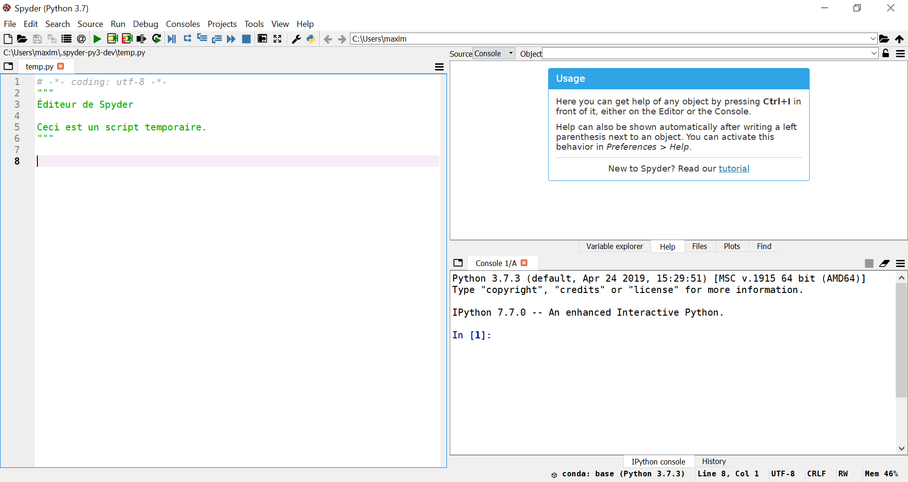

La fenêtre qui s'ouvre est composée de trois volets principaux.

L'**éditeur** (editor) se trouve à gauche. C'est dans ce panneau qu'on
pourra écrire et enregistrer les scripts Python. On peut en fait y ouvrir
n'importe quel type de fichier texte.

En bas à droite se trouve la **console IPython**. **IPython** est
un terminal *Python* interactif, plus complet que
le terminal de base **Python**. On
peut donc directement exécuter du code dans cette console.
Lorsqu'on exécute du code écrit dans l'éditeur, ce code-là est en
fait directement exécuté par la console IPython ouverte.

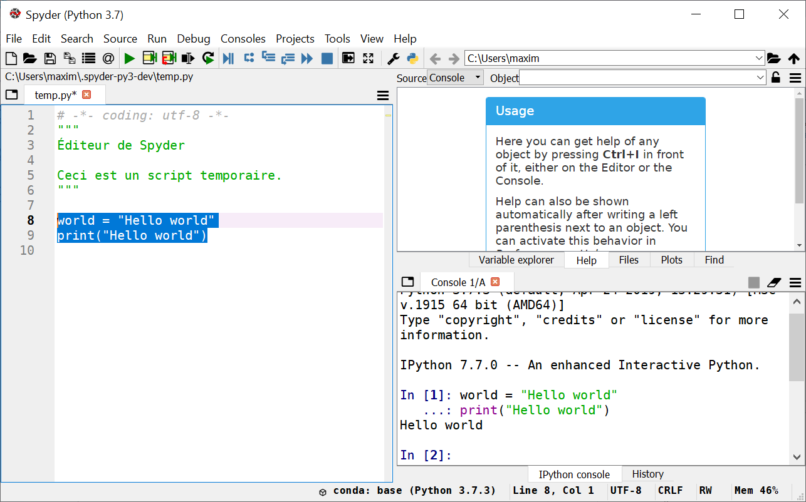

Lorsqu'on écrit du code dans l'éditeur, des suggestions
et des aides apparaissent automatiquement.

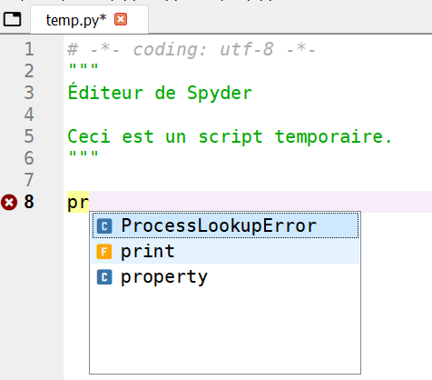

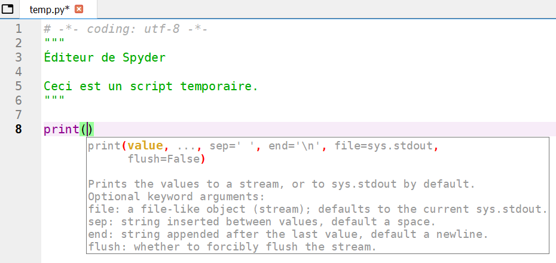

La panneau **History** (historique) se trouve dans le même volet. Il
contient l'historique des commandes qui ont été exécutées par la console.
(Ici les deux lignes dans l'éditeur ont été exécutées en les
sélectionnant et en appuyant ensuite sur la touche ``F9``).

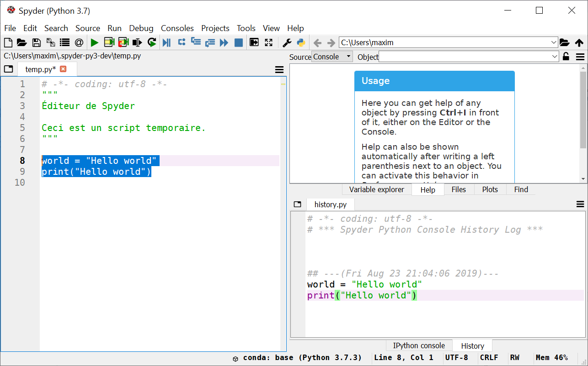

En haut à droite se trouvent les panneaux **Help** (aide), **Files** (
explorateur de fichiers), **Plots** (figures), **Find** (rechercher
et remplacer) et **Variable explorer** (explorateur de variable).

Les panneaux **Variable explorer** et **Plots** sont particulièrement
intéressants.

Le **Variable explorer** permet d'inspecter les objets (i.e. variables) qui
sont sont actifs dans la session actuelle. Un tableau affiche leur nom,
leur type, leur taille et leur valeur. Dans l'exemple ci-dessous, on
peut voir que la *string* *world* est visible dans le panneau.

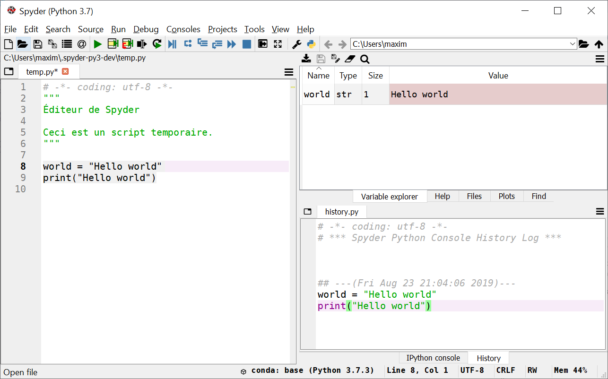

Le panneau **Plots** permet de voir l'historique des figures créées
dans la session active. Dans l'exemple ci-dessous, deux figures sont
générées avec *Matplotlib*, on peut les faire défiler dans le panneau et les
enregistrer sur le disque.

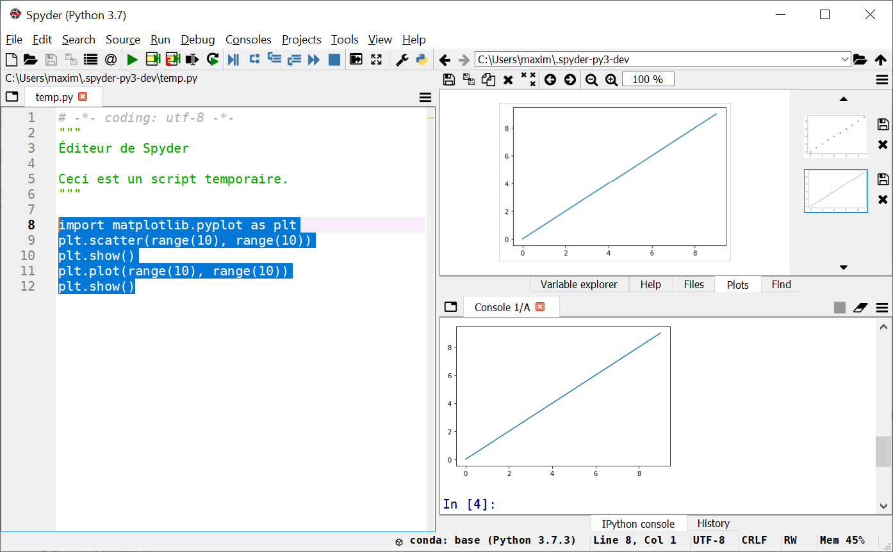

.. attention::

    Le panneau **Plots** est seulement disponible
    à partir de la **version 4 de Spyder**.

La barre d'adresse en haut à droite permet de configurer le *dossier
en cours*, qui est aussi appelé *dossier de travail*.
Par exemple, cela est utile lorsqu'on souhaite ouvrir un
fichier avec un lien relatif.

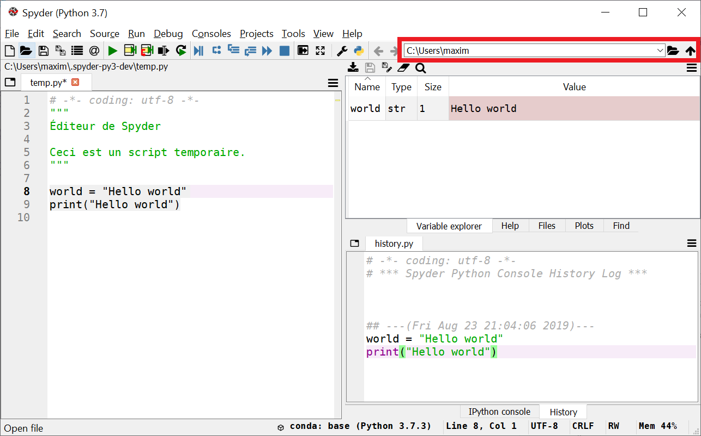

.. tip:: 

    Pour définir un dossier de travail en Python directement, on peut
    écrire les deux instructions suivantes:
    ``import os; os.chdir(path\to\workingdirectory)``

Raccourcis
**********

Les raccourcis permettent de se faciliter la vie. Voici
une courte liste de raccourcis intéressants à connaître:

+---------+---------------------+------------------------+
| Context | Name                | Shortcut               |
+=========+=====================+========================+
| editor  | run selection       | F9                     |
+---------+---------------------+------------------------+
|         | run                 | F5                     |
+---------+---------------------+------------------------+
| editor  | copy line           | Ctrl + Alt + [Up/Down] |
+---------+---------------------+------------------------+
| editor  | move line [up/down] | Alt + [Up/Down]        |
+---------+---------------------+------------------------+
| editor  | delete line         | Ctrl + D               |
+---------+---------------------+------------------------+
| editor  | toogle comment      | Ctrl + 1               |
+---------+---------------------+------------------------+
| editor  | indent / unindent   | Tab / Shift + Tab      |
+---------+---------------------+------------------------+
| editor  | code completion     | Ctrl + Space           |
+---------+---------------------+------------------------+
|         | switch to console   | Ctrl + Shift + I       |
+---------+---------------------+------------------------+
|         | switch to editor    | Ctrl + Shift + E       |
+---------+---------------------+------------------------+
| console | code completion     | Tab                    |
+---------+---------------------+------------------------+
| console | clear console       | Ctrl + L               |
+---------+---------------------+------------------------+
| console | array builder       + Ctrl (+ Alt) + M       |
+---------+---------------------+------------------------+

.. tip::

    Le raccourci pour commenter n'est pas très pratique, on
    peut le changer à ``Ctrl + :`` par exemple.

IPython
*******

Le terminal **IPython** est doté de fonctionnalités agrémentées par
rapport au terminal **Python** classique.
Parmi elles les commandes magiques (*magic commands*)
qui sont à exécuter dans la console précédées du symbole ``%``.

* ``%who`` et ``%whos`` affiche la liste des objets présents dans
  le namespace (plus complet que l'explorateur de variable).
* ``%timeit sum(range(1_000_001))`` calcule le temps moyen qu'il
  faut pour calculer une somme de zéro à un million.
* ``%reset`` réinitialise le namespace (supprime la référence aux objets
  créés), cela a pour effet de "vider" l'explorateur de variable.
* ``%lsmagic`` affiche la liste complète des commandes magiques.

On peut obtenir l'aide d'un objet en rajoutant ``?`` (ou ``??`` pour
plus d'informations) après son nom. Par exemple, ``print?`` va afficher
l'aide de la fonction ``print``. 

On peut utiliser les commandes de la **Command Prompt** en les précédant
d'un ``!``. Par exemple, ``!dir`` est équivalent à ``dir`` dans la
**Command Prompt**.

.. tip:: 

    ``%quickref`` affiche toutes les commandes spéciales mentionnées
    ci-dessus.


Workflow
********

Lorsqu'on exécute du code écrit dans l'éditeur (avec ``F5`` pour
exécuter la totalité du script ou ``F9`` pour exécuter qu'une ou
plusieurs lignes), le code est exécuté dans la console **IPython**.
Les objets créés (variables, fonctions, etc.) sont toujours **vivants**,
ils sont réutilisables depuis la console **IPython**. Ils le sont donc
aussi depuis l'éditeur, le code de celui-ci étant exécuté dans la
console. Cette mécanique permet d'élaborer un script de manière souple
et itérative. Voici un **exemple de workflow** avec l'éditeur et la console:

1. On écrit le début du code dans l'éditeur et on l'enregistre.
2. En parallèle, on peut s'aider de la console pour construire le code, en
   vérifiant comment s'exécute une fonction, le format d'une donnée, etc.
3. Si on le souhaite, le code qui vient d'être exécuté dans la console
   peut être collé vers l'éditeur après l'avoir copié dans la console
   (on peut aussi le copier depuis l'historique).
4. Lorsque le code dans l'éditeur correspond à un bloc logique, on peut
   l'exécuter entièrement avec ``F5``. On peut aussi l'exécuter ligne
   par ligne avec ``F9``.
5. Le résultat est alors accessible et peut être inspecté depuis la console
   (et l'explorateur de variable). On peut alors vérifier si le code
   a bien fonctionné. En l'exécutant ligne par ligne, on peut
   voir en direct dans l'explorateur de variable la création des objets
   et l'évolution de leur valeur.

.. tip::

    On peut séparer des blocs de code dans l'éditeur en écrivant
    ``#%%`` sur une ligne. Le code situé sous cette ligne et entre
    la prochaine ligne ``#%%`` est une cellule (*cell*). Le code
    d'une cellule peut être exécuté en appuyant sur ``Ctrl + Enter``.
    ``Shift + Enter`` effectue la même opération puis déplace
    le curseur à la cellule suivante.

La mécanique éditeur/console et la possibilité d'exécuter seulement
une partie du code (``F9``) permet aussi de **debugger** le code
manuellement et facilement.

.. hint::

    **Spyder** intègre aussi un *debugger* interne. Il peut être utile
    d'apprendre à se servir de cet outil, car il évite d'avoir à modifier
    le code pour le débugger (on rajoute souvent des ``print()`` dans le
    code lorsqu'on l'inspecte manuellement) et permet de débugger plus
    facilement de gros scripts. 

Terminal interactif Python
--------------------------

L'interpréteur **Python**, qui est le programme capable d'exécuter
un script écrit en Python, a aussi un mode **interactif**. Pour lancer
l'interpréteur dans ce mode, il suffit d'ouvrir un terminal (
**Anaconda Command Prompt** ou **Command Prompt**) et taper ``python``.
Du code Python peut maintenant être entré après le symbole ``>>>``
et exécuter en appuyant sur ``Enter``. En d'autres mots, on vient
d'allumer le moteur de Python, il attend maintenant nos instructions
pour pouvoir les exécuter.

.. note:: 

    Le *mode interactif* de l'interpréteur Python est aussi appelé
    **REPL**, pour *Read-Eval-Print Loop*.

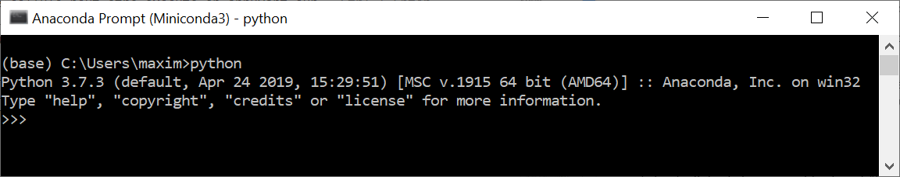

L'exemple ci-dessous
montre l'exécution de l'instruction ``print("hello world")``. Le
résultat de cette instruction est affiché directement en dessous. La
ligne du dessous affiche ``>>>``, indiquant qu'il est possible
de taper une nouvelle instruction.

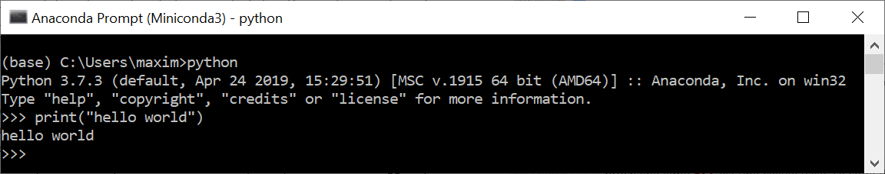

Pour quitter l'interpréteur interactif, on peut appuyer sur
``Ctrl + Z + Enter`` ou taper ``quit()``.

L'interpréteur interactif Python a cependant quelques limites. Il
n'affiche aucune couleur et n'a pas la fonctionnalité *autocompletion*.

Un autre interpréteur interactif Python disponible est **IPython**.
Pour le lancer, il suffit de taper ``ipython`` dans un terminal.
Au lieu du symbole ```>>>```, **IPython** affiche ``In [X]`` pour
signaler la ligne où l'on peut écrire du code. On peut voir
que le code entré est colorisé, cela en facilite la lecture.

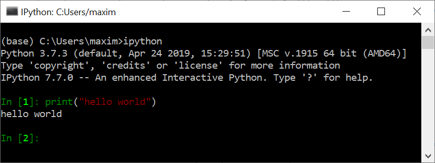

Lorsqu'on écrit du code dans ce terminal, l'appui sur la touche
``Tab`` montre les possibilités disponibles. On peut ensuite continuer
à appuyer sur ``Tab`` (ou avec les flèches) pour naviguer dans les
propositions faites et appuyer sur ``Enter`` pour en sélectionner une.

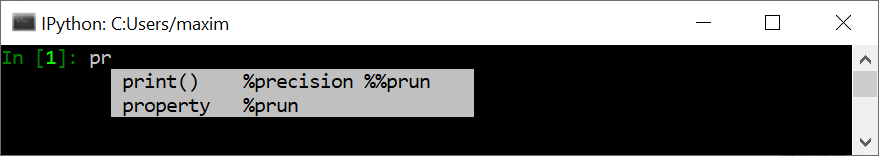

Pour quitter l'interpréteur interactif **IPython**,
on tape ``quit()``.

L'interpréteur **IPython** peut aussi être lancé dans sa propre fenêtre.
Il suffit d'exécuter ``jupyter qtconsole`` dans un terminal.

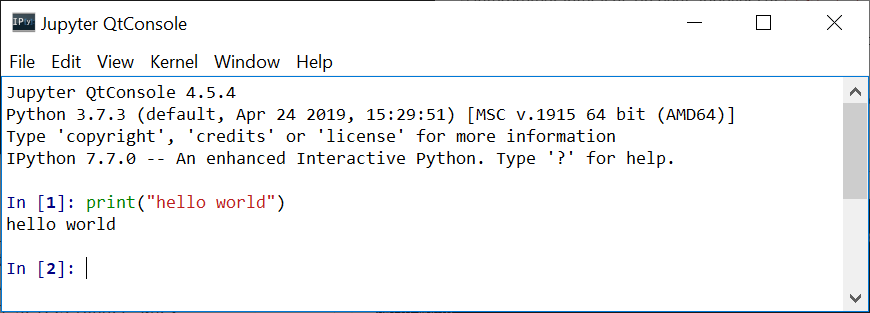

Dans cette fenêtre, l'aide d'une fonction s'affiche lorsqu'on
tape la parenthèse d'ouverture.

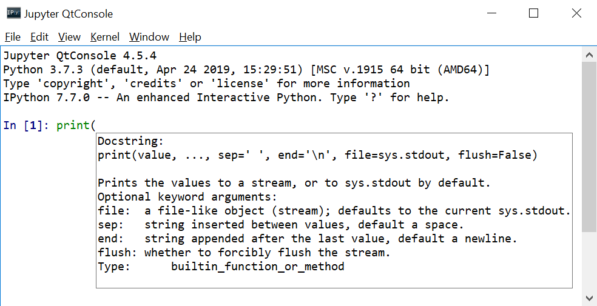

Il est possible d'afficher des figures directement dans la console
(dans les deux premiers interpréteurs interactifs, les figures s'ouvrent
dans une nouvelle fenêtre).

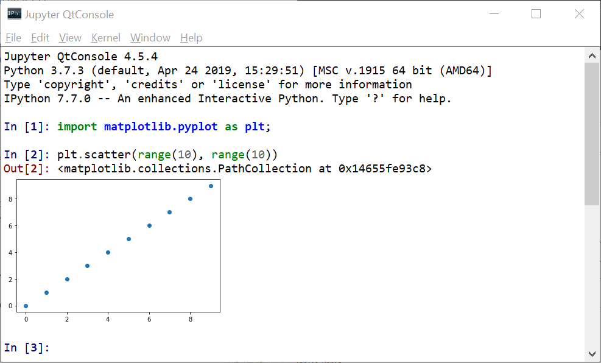

